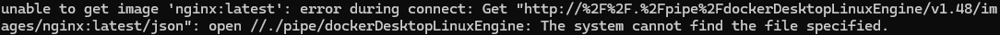
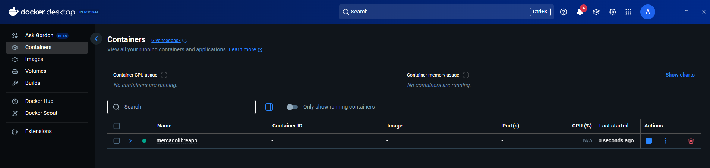
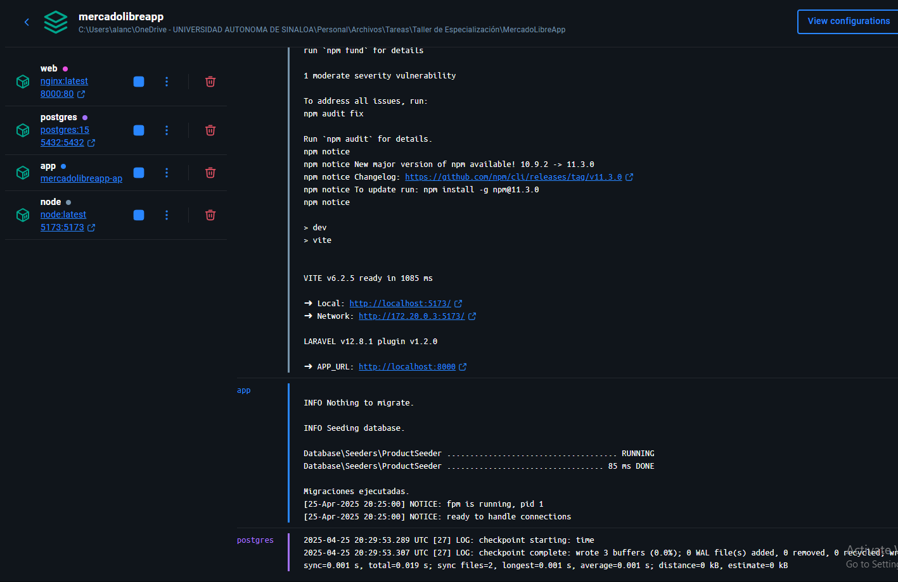
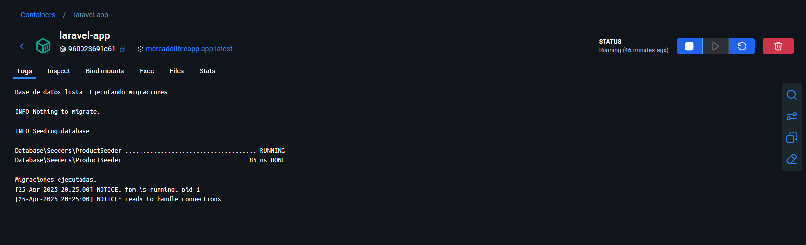
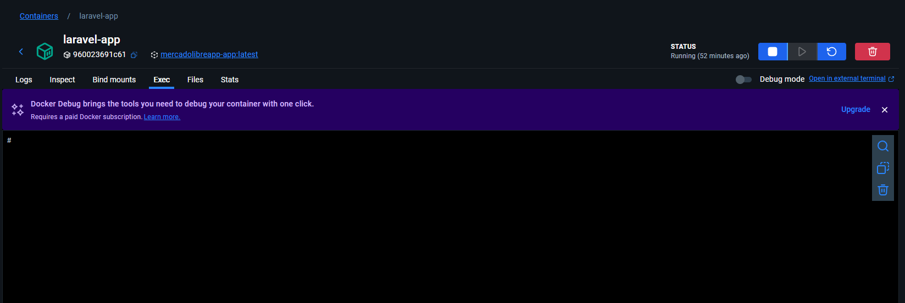
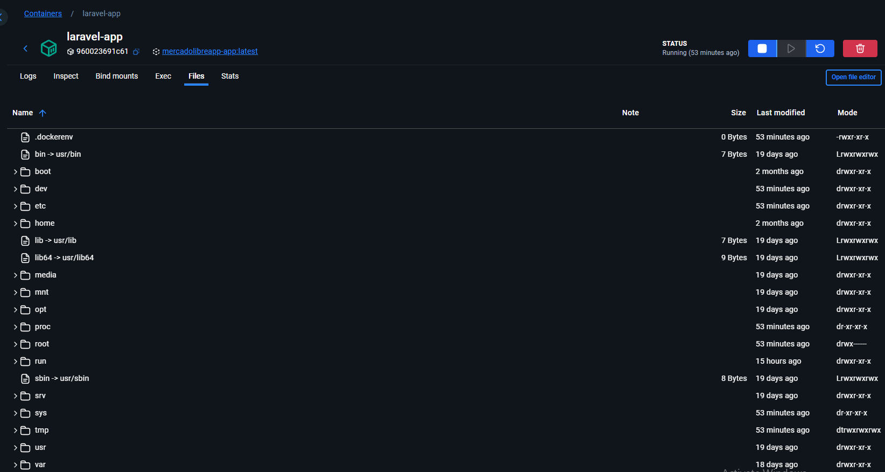

# MercadoLibreApp
Un trabajo de universidad para simular la aplicación de Mercado Libre

## Instrucciones para Correr el proyecto con Docker
Se agregó un archivo docker-compose.yml, este contiene la configuración para que Docker incie los contenedores necesarios para trabajar de manera fácil en cualquier computadora.

> Solamente necesitas tener instalado Docker y tenerlo corriendo en tu computadora para que funcione.
>> Es muy importante validar que siempre se tenga Docker Desktop abierto para el funcionamiento de los comandos de Docker\
>>**Este error sería el que estarían viendo en caso de no abrir *Docker Desktop***

Usa en tu terminal ya con Docker abierto el comando

`docker-compose up --build -d`

 

---

 

Cuando ya se corra este comando va a instalar todo lo necesario y al final dejará corriendo los servicios.

Así saldría en ***Docker Desktop***

 

---

 

Si entras al contenedor podrás ver los diferentes servicios corriendo

 

---

 

De esta manera se verá si entras a cualquiera de los servicios.

 

---

 

En el apartado de Exec podrás correr los comandos que desees.

 

---

 

En el apartado de Files será donde puedas verificar cualquier archivo que desees si es necesario, en caso de validar cambios que hayas hecho, etc.

 

---

 

En este apartado podrás correr diferentes comandos que necesites, los servicios corriendo son los siguientes:
- web: Podrás hacer cosas de nginx (en dado caso que necesites).
- postgres: Consultas a base de datos (también puedes usar pgadmin con las credenciales del archivo **docker-compose.yml**)
- app: En este servicio puedes correr cualquier comando de PHP como `php artisan migrate`.
- node: Puedes correr comandos de node (en este servicio por defecto ya se está corriendo `npm run dev` para renderizar los cambios en el frontend).

> Cualquier cambio que hagas en los archivos se verá reflejado automáticamente en los contenedores de Docker, por lo que pueden trabajar sin problemas desde ahí y luego correr comandos en los contenedores para migraciones, creaciones de rutas, etc.

---

> Cuando corres el comando `docker-compose up --build -d` automáticamente se corren las migraciones y seeders (se crean las tablas si no están creadas y se meten registros de ejemplo).